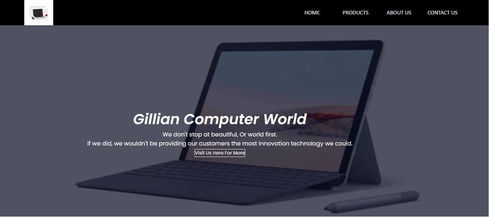
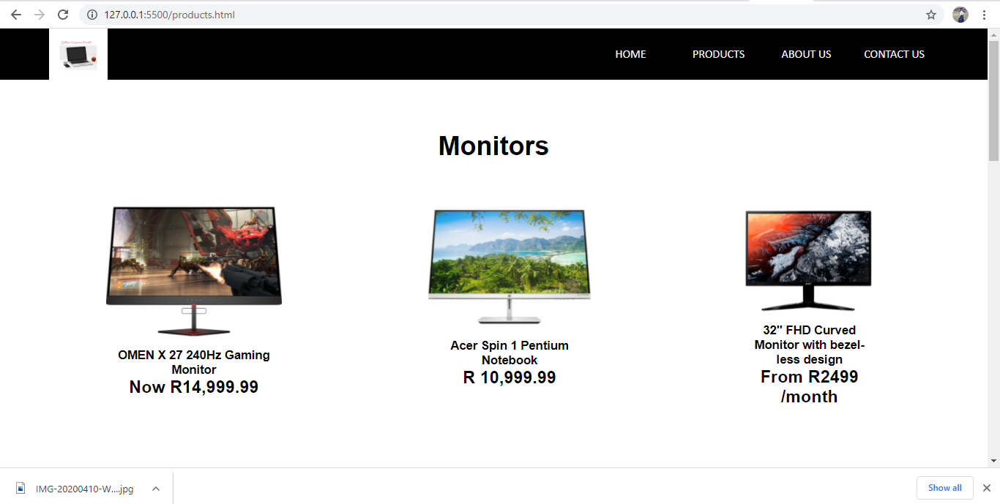
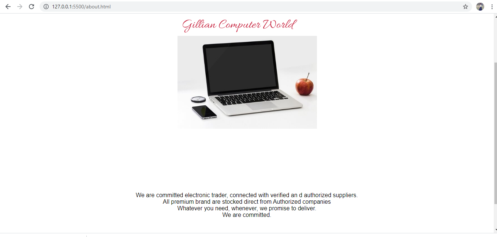
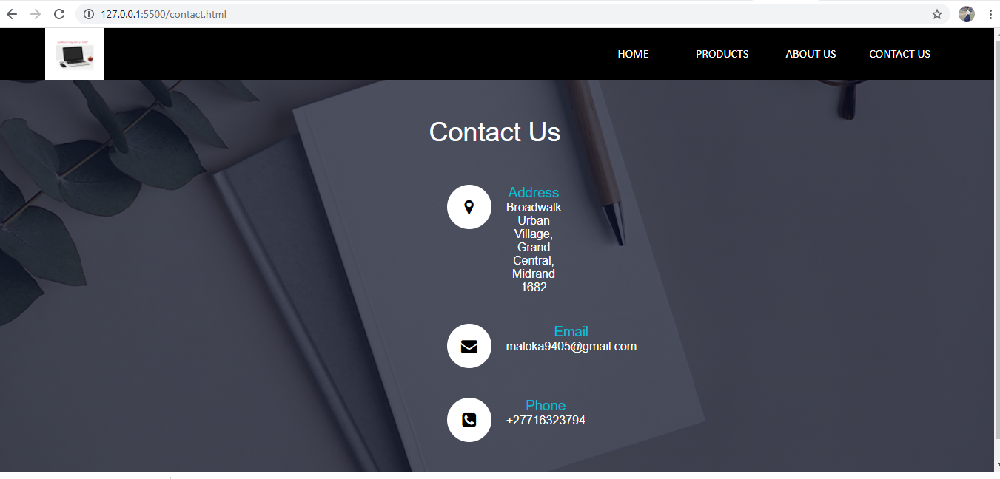

# Gillian-Computer-World
The Gillian-Computer-World project is the website that sells all types of computers

## Screenshot

## Built With

- HTML
- CSS
- Fontawesome
- Javascript
  ​

## Live Demo

​
[Live Demo Link](http://127.0.0.1:5500/index.html)
​

## Getting Started

​
**Clone the repo on your system, find the index.html file and open with your browser**
​

## Authors
​
#### 👤 **Gillian Maloka**
​
- Github: [@Maloka0716323794](https://github.com/Maloka0716323794)
- Linkedin: [Gillian Maloka](https://www.linkedin.com/in/gillian-maloka-0b1284149/)

## Contributing

Contributions, issues and feature requests are welcome!
​
Feel free to check the [issues page](https://github.com/Maloka0716323794/websites/issues).
​

## Show your support

Please, give a ⭐️ if you like this project!
​

## Acknowledgments

- Fontawesome
- Our Stand up teams
- Microverse TSE

  ​
## License
​
This project is [MIT](lic.url) licensed.